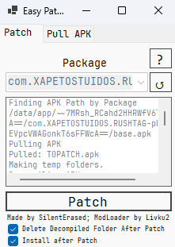

<table>
<tr>
<td width="400">

</td>
<td>

# Unity IL2CPP Patcher

> [!IMPORTANT]
> This patcher only supports **native mods (`.so` files)**. Managed C# mods are not supported.

A tool designed for patching Unity IL2CPP games.

## 🆘 How to Use It

1. Patch the game.  
2. Launch the game once (or 2 times) to create a folder at `Android/data/packageName/nativemods`.  
3. Close the game.  
4. All native libs in the directory will be loaded automatically.  

Mod Loader Used: [ModLoader](https://github.com/Livku2/ModLoader/tree/master). 

## 👥 Credits
Original Version Creator:
  pubertcs (Discord) - Made Original version
ModLoader Used:
  Livku2 - ModLoader (https://github.com/Livku2/ModLoader)
Improved & Maintained by:
  SilentErased - Fixed bugs, optimized stability, new design, etc

## 💴 Support Me

💠 **TON:** [`UQByUL386yk27JU-74w2mBpfyjc8-c7IWk32IEkqGaRd-P5G`](https://tonviewer.com/UQByUL386yk27JU-74w2mBpfyjc8-c7IWk32IEkqGaRd-P5G)
